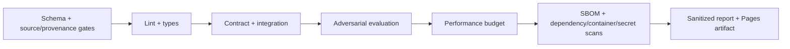

# Full coding workflow — SentinelForge AI Gateway

Estimated solo build: 22–30 focused days including the first two public-source adapters. Each stage ends in a testable vertical slice. A coding agent must not proceed past a failed gate.

## Stage 0 — Evidence, baseline, and contracts (1 day)

**Build:** copy fixtures, write Architecture Decision Records for deterministic policy versus LLM guard, provider abstraction, content-minimized telemetry, public-source quarantine and split isolation. Record the “always strong” baseline over the fixture suite using simulated price/latency profiles.

**Tests/validation:** validate JSONL/schema, confirm label distribution and unique IDs, hash fixtures, run secret scan, and ensure baseline calculation is deterministic across two runs.

**Exit:** `baseline.json` and data card exist; no improvement claim yet.

## Stage 0A — Dataset contracts, registry and local importer (3 days)

**Build:** implement `CanonicalCase` from `data/canonical_case.schema.json`, `SourceManifest`, source/derived release registry, disabled-by-default configuration, quarantine directory, local/offline fetcher, canonical synthetic-fixture importer, deterministic case IDs/hashes and immutable release manifests.

**Tests/validation:** JSON Schema accepts/rejects boundary cases; unknown fields fail; duplicate IDs/hashes; deterministic rebuild; path traversal/symlink/unsupported archive/oversized field/uncompressed-size limits; importer cannot access network, provider/tool credentials or active policy mutation; licence/privacy/review fields required.

**Exit:** repository fixtures build into a versioned release twice with identical IDs, splits and release hash; a failing source remains quarantined.

## Stage 0B — First public adapters and benchmark isolation (3–5 days)

**Build:** implement Dolly importer for benign hard negatives and BIPIA importer for indirect injection; add an isolated AgentDojo result adapter without embedding AgentDojo execution inside the gateway. Pin exact revisions/checksums, store component licences/attribution, add policy-label templates and group/source/family-aware splitting.

**Tests/validation:** recorded tiny source fixtures map exactly; BIPIA source task truth remains separate from expected gateway decision; near duplicates cannot cross splits; external holdout registry denies training access; content/PII/secret scans; source update changes derived release; no live network in CI.

**Exit:** one approved benign and one injection source produce a candidate release with complete data card, rejection report and untouched external holdout. Activation remains manual.

## Stage 1 — Skeleton and identity boundary (2 days)

**Build:** FastAPI skeleton, configuration validation, signed local tokens/API-key fixtures, tenant/app context middleware, health endpoint, structured error contract, SQLite/Postgres repository interface.

**Tests:** unit tests for token expiry/signature/roles; API tests for 401/403/size limit; cross-tenant repository tests; configuration refuses insecure production defaults.

**Exit:** authenticated request creates a content-free decision stub and correlation trace.

## Stage 2 — Deterministic policy engine (3 days)

**Build:** typed policy schema, YAML loader/versioning, decision reason codes, deny/allow/approval results, tool/model allowlists, budgets, policy simulation.

**Tests:** table-driven tests for every rule and precedence; property test that unknown action is denied; mutation test target on high-risk rules; candidate-policy replay does not modify active version.

**Exit:** all fixture decisions are correct without invoking an LLM.

## Stage 3 — Risk classification and guards (3 days)

**Build:** regex/heuristic baseline, scikit-learn text classifier trained on repository synthetic plus only licence-approved `train` cases, optional BERT experiment behind same interface, input size/encoding checks, output secret/PII/schema guard. The training loader reads split-scoped registry records, never arbitrary files.

**Tests:** source/family-stratified evaluation with confusion matrices; adversarial casing/spacing/encoding variants; public benign false-positive regression; malformed/nested JSON and oversized output tests; train/test near-duplicate scan; assertion that external holdout IDs never reach fit/tune; compare classifier latency and quality.

**Exit:** release thresholds pass or the simplest passing classifier remains selected; model artifact is versioned in MLflow with data hash.

## Stage 4 — Model routing and provider contracts (3 days)

**Build:** `ModelProvider` interface, FakeSmall/FakeStrong, optional Ollama, route eligibility, utility score, circuit breaker, timeouts, usage normalization, OpenAI-compatible response mapping.

**Tests:** provider contract suite; deterministic tie-break; no-compliant-route fail-closed; budget exhaustion; timeout/cancel; predicted versus fixture latency/cost; shadow route evaluation.

**Exit:** benign simple and complex requests take different routes while the quality floor holds.

## Stage 5 — Approval and bounded evaluation agent (2 days)

**Build:** approval interrupt/state; exact request/decision/tenant/subject/tool/argument/policy binding; authorized approver check; expiry, nonce, transactional one-time consume and idempotency; separate policy author/approver fixtures; read-only LangGraph evaluation assistant with step/call/time budget; deterministic policy publish gate followed by independent human activation.

**Tests:** approve/reject/expire/replay/race; unauthorized or self-approver rejection; approval cannot change tenant, subject, tool, normalized arguments, scope, budget or policy version; approval cannot override `DENY` or a failed policy gate; independent policy activation audit; graph step exhaustion; injected eval case cannot call an unlisted tool or publish policy; checkpoint resume is idempotent.

**Exit:** elevated fixture cannot invoke until a valid scoped human approval exists, and a policy author cannot activate their own production candidate.

## Stage 6 — Observability and dashboard (3 days)

**Build:** OTel spans, Prometheus metrics, Langfuse local traces, Grafana panels, content-off audit store, dashboard for route/deny/cost/latency/quality.

**Tests:** trace propagation across all components; audit event exists on success and each failure; fixture secret absence in logs/traces; exporter outage does not break serving; metric cardinality budget.

**Exit:** one decision ID joins UI, trace, audit, and evaluation outcome.

## Stage 7 — Full harness, performance, and security gate (3 days)

**Build:** evaluation CLI, HTML/JSON report, dataset/source/family coverage panel, immutable dataset/model/policy lineage, 1,000-request load profile, adversarial/metamorphic suite, failure injection, SBOM/scans.

**Tests:** thresholds from PRD; p50/p95/p99 overhead; per-source/per-family attack recall and benign-block confidence interval; cross-tenant fuzzing; dataset poisoning/checksum/privacy/licence/leakage failures; dataset importer/release-approver separation; approval attempt cannot waive a failed data gate; dependency/container/secret scans; forced provider/database/classifier/telemetry failures.

**Exit:** one command returns non-zero on any quality, security, budget, or latency regression.

## Stage 8 — Packaging and proof (2–4 days)

**Build:** Docker Compose, Make targets, seeded UI reset, screenshots/GIF, sanitized static Pages replay, benchmark methodology, limitations, three-minute demo, issue templates.

**Tests:** clean-machine rehearsal; offline/keyless CI; broken-link check; Pages bundle contains no token/prompt/secret; accessibility smoke test; follow README verbatim on a new checkout.

**Exit:** three external testers can reach the “aha” event in under five minutes.

## CI workflow

Pull requests run deterministic fake models. Nightly local/manual jobs may evaluate Ollama or optional providers, but their availability can never decide core CI.

## Rollback and failure plan

- Policy versions are immutable; activate by pointer and roll back to last passing version.
- Classifier/model profile promotion requires an evaluation run; keep last two passing artifacts.
- Dataset releases are immutable; activate by pointer only after data and evaluation gates, retain the previous passing release and roll back the complete dataset/classifier/policy bundle when compatibility requires it.
- If classifier is unhealthy, apply deterministic high-risk rules and deny ambiguous elevated actions.
- If telemetry is unhealthy, continue only when durable audit can be written; fail closed for approval/elevated actions.
- If all providers fail, return a retryable error—never silently switch to a policy-ineligible route.

## Post-MVP experiments

Run one variable at a time: dataset source, classifier family, route weights, cache policy, or prompt compression. Publish the Pareto frontier, per-source/family outcomes and rejected variants. Do not tune repeatedly on the external holdout. Add real cloud adapters only after the local architecture and user need are validated.
