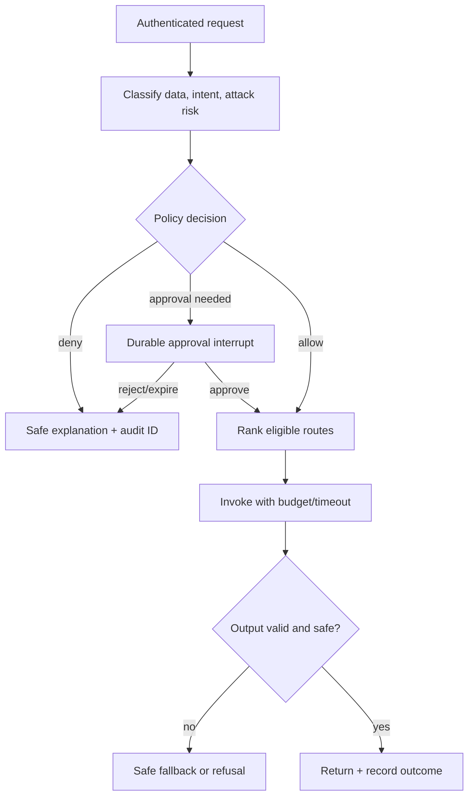

# Quick PRD — SentinelForge AI Gateway

## 1. Product summary

SentinelForge is a policy-enforcing gateway for model and agent traffic. It gives AI platform teams one place to authenticate callers, prevent common AI attacks, constrain data/model placement, optimize provider selection, set budgets, and investigate decisions.

## 2. Problem and evidence

Model access is usually embedded directly in applications. This fragments IAM, guardrails, spend attribution, telemetry, and incident response. Agent tool access increases the blast radius: untrusted input can influence expensive calls or sensitive actions. Enterprise guidance from AWS, Microsoft, OWASP, and NIST converges on centralized model/tool controls, least privilege, AI-native observability, evaluation, and human oversight; see the portfolio [SOURCES.md](../SOURCES.md).

## 3. Target users and jobs

| Persona | Job to be done | Current pain |
|---|---|---|
| AI platform lead | Onboard a model/app under standard controls | Weeks of duplicated integration and review |
| Security engineer | Prevent and investigate injection/exfiltration | Incomplete model/tool traces and ad hoc filters |
| FinOps lead | Allocate and reduce AI cost | Spend hidden behind shared keys/accounts |
| App developer | Call an approved model without learning every provider | Provider lock-in and inconsistent errors |

## 4. MVP scope

- OpenAI-compatible `/v1/chat/completions` subset plus a native `/v1/decide` dry-run endpoint.
- API-key/JWT fixture authentication, tenant and application identity, RBAC/ABAC policy.
- Input data classification, injection/abuse screening, tool allowlist, token/step/budget limits.
- Route across deterministic fake models and local Ollama; optional mocked provider adapters.
- Output schema/secret/PII validation, safe failure, and full decision audit.
- Dashboard for allowed/denied traffic, route mix, unit cost, latency, quality, and red-team results.
- Policy versioning, simulation, rollback, and release evaluation.
- Version-pinned import of approved public datasets through quarantine, licence/provenance review and canonical normalization.
- Dataset registry with immutable releases, source/family-aware splits, data cards and per-source evaluation.

## 5. Out of scope

- Training or hosting a frontier model; claiming universal prompt-injection prevention.
- Real enterprise DLP replacement, production billing, legal compliance certification, or raw chain-of-thought collection.
- Autonomous policy modification or automatic high-impact incident response.
- Live public-dataset access in the serving path, automatic “latest” dataset updates, or redistribution without source-specific licence review.

## 6. North-star and target improvements

**North star:** `safe_successful_requests / estimated_model_cost_usd`.

| Metric | Baseline | MVP target | How measured |
|---|---|---|---|
| Model cost per successful request | Always route to strongest fake/provider profile | 25–40% reduction | Replay same labeled suite, identical price table |
| Gateway overhead | No gateway | p95 ≤120 ms excluding downstream model | OTel spans over 1,000 local requests |
| Attack recall | Simple regex baseline | ≥90% on labeled attack fixtures | Blocked attacks / all attacks |
| Benign-block rate | N/A | ≤5% | Blocked benign / all benign |
| Quality pass rate | Strongest-model baseline | No more than 3 percentage-point absolute drop | Deterministic rubric/golden exact match |
| Decision trace coverage | App-specific logs | 100% requests get decision/audit ID | Integration assertion |
| Policy onboarding time | Manual baseline task timed once | ≥50% reduction for second sample app | Timed reproducible developer task |
| Evaluation provenance coverage | Ad hoc downloaded files | 100% released cases carry source/revision/licence/hash | Dataset release validator |
| Cross-split exact duplicates | Random row split | 0 | Content-hash comparison across splits |
| External-holdout isolation | No explicit holdout | 100% holdout cases excluded from training/tuning inputs | Registry lineage assertion |

Targets are hypotheses. Publish confidence intervals and fixture limitations; do not manufacture “achieved” numbers.

## 7. User stories and acceptance

- As a platform engineer, I can add a tenant policy without changing gateway code; a simulation shows which historical requests change outcome.
- As a security engineer, I can replay an attack suite and block release when attack recall or benign-block rate misses threshold.
- As an app developer, I get a stable response/error contract independent of provider.
- As FinOps, I can attribute estimated tokens/cost by tenant, app, route, and policy version without viewing prompt text.
- As an approver, I can approve/reject an elevated tool call; expired approvals cannot execute.
- As a policy approver, I cannot activate my own authored production policy or a candidate that failed an automated gate.
- As a security evaluator, I can add an approved public source through a manifest without changing gateway-serving code.
- As a data steward, I can see source revision, component licence, importer version, privacy result, split and rejection reason for every released case.
- As a release owner, I can compare results by dataset and attack family so a strong aggregate score cannot hide a failed category.

## 8. Product workflow

## 9. Release gates

- All security policy cases and tool-authorization tests pass.
- Attack recall ≥90%, benign-block ≤5%, quality drop ≤3 points.
- p95 local overhead ≤120 ms and no route exceeds declared budget.
- No secrets in repository or telemetry snapshots; dependency and container scans have no unresolved critical finding.
- Every active dataset release passes schema, provenance, privacy, licence, deduplication, split-leakage and stratified-review gates.
- Public external-holdout cases are never visible to classifier training, prompt tuning, policy tuning or route-profile fitting.
- Production policy activation requires an independent `policy_approver` after all automated gates pass; a `policy_author` cannot self-approve.
- Dataset activation requires an authorized human release approver distinct from the importer, after licence/security review and every automated data/evaluation gate passes.
- Runtime elevated actions execute only with an unexpired, one-time human approval bound to the exact request, tenant, subject, tool, arguments and policy decision.

Human approval cannot override a deterministic deny, waive a failed gate, widen scope, change tenant/tool/arguments, bypass budget/output controls, or expose holdout data to training.

## 10. Risks and decisions

- **False confidence:** label the product a defense layer, show misses, and keep attack corpus extensible.
- **Filter latency:** run cheap deterministic checks first; cache tenant policy; invoke ML only when needed.
- **Model/provider drift:** version capability/price profiles and rerun evaluation before promotion.
- **Sensitive logs:** metadata-first telemetry, hashing/redaction, short local retention, privileged payload capture off by default.
- **Benchmark contamination:** group/source/family-aware splitting, untouched external suites, near-duplicate detection and immutable lineage.
- **Public-data poisoning/supply chain:** pinned revisions, checksums, quarantine, no source-code execution during import and human approval before activation.
- **Licence incompatibility:** per-component licence records and disabled-by-default source manifests; reject uncertain redistribution rights.

## 11. Success after launch

For portfolio use: three external users reproduce the benchmark and one platform/security practitioner gives structured feedback. For commercialization: five design-partner interviews, two local pilots, and at least one team asking for shared policy/audit functionality.
