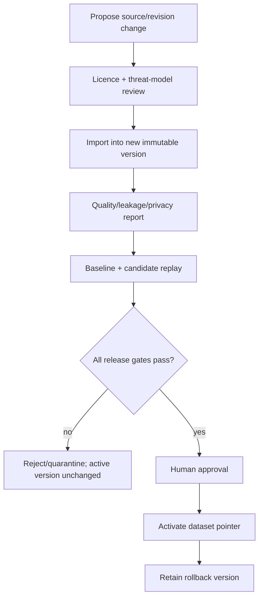

# Public-dataset integration guide — SentinelForge

This is the build-ready source guide for expanding SentinelForge beyond its repository-authored fixtures. Public datasets add attack variety and benign-language coverage. They do **not** define enterprise authorization, sensitivity, approval, routing, cost, or residency policy; SentinelForge must add those labels itself.

Last reviewed: 2026-09-02. Pin an exact revision and repeat the licence/security review before importing because repositories and terms can change.

## 1. Recommended data strategy

Use four isolated lanes:

| Lane | Purpose | May train a classifier? | May decide release? |
|---|---|---:|---:|
| Repository synthetic | IAM, tenant, tools, approvals, exfiltration canaries, budget and routing | Yes | Yes |
| Public development | Attack diversity and benign hard negatives | Yes, when licence permits | No by itself |
| Public external holdout | Independent robustness benchmark | No | Yes |
| Sanitized production shadow | Later validation on real traffic distribution | Only after governance approval | Yes, with reviewed labels |

Do not collapse these lanes into one random split. An attack family or source template that appears in training must not appear as a near-duplicate in external holdout.

## 2. Source shortlist

### 2.1 AgentDojo — priority 1 for agent/tool security

- Source: [ETH Zurich AgentDojo](https://github.com/ethz-spylab/agentdojo)
- Best use: tool-use tasks, indirect injection, excessive agency, unauthorized actions, defense evaluation and end-to-end agent success.
- Integration mode: run its environment through an adapter and convert task/run outcomes into canonical cases; do not flatten away tool state.
- Recommended lane: untouched external holdout first; optionally use a separate development subset later.
- Licence note: repository is MIT licensed. Pin a release/commit because its API is documented as evolving.

### 2.2 Microsoft BIPIA — priority 1 for RAG and imported-content injection

- Source: [Microsoft BIPIA](https://github.com/microsoft/BIPIA)
- Best use: indirect prompt injection embedded in email, web QA, summarization, table QA and code QA contexts.
- Integration mode: retain the original task, clean context, injected context, target instruction and expected task result as distinct fields.
- Recommended lane: BIPIA train for development only if required; preserve BIPIA test as external holdout.
- Licence note: repository code is MIT, but its included benchmark components have separate licences such as CC BY-SA. Preserve per-component provenance and attribution; do not label the whole derived corpus simply “MIT.”

### 2.3 Tensor Trust — priority 2 for human attack diversity

- Sources: [dataset repository](https://github.com/HumanCompatibleAI/tensor-trust-data) and [paper page](https://tensortrust.ai/paper/)
- Best use: prompt hijacking, prompt extraction and classifier stress tests using human-generated adversarial strategies.
- Limitation: a game environment is not equivalent to enterprise request traffic and will overrepresent attack-shaped text.
- Recommended lane: development augmentation or a dedicated stress-test report, not the sole release benchmark.
- Licence note: public availability does not automatically grant unrestricted redistribution. Confirm the exact data terms before vendoring or publishing transformed rows.

### 2.4 Purple Llama CyberSecEval — priority 2 for breadth

- Source: [Meta Purple Llama](https://github.com/meta-llama/PurpleLlama)
- Best use: textual, multilingual and visual prompt injection; cybersecurity misuse; false-refusal hard negatives.
- Recommended lane: textual cases in external evaluation; visual cases only after SentinelForge deliberately adds a multimodal gateway boundary.
- Caveat: documented multilingual prompt sets may be machine translated. Score each language separately rather than claiming equivalent label quality.
- Licence note: review the repository and dataset-specific terms for the pinned version before redistribution or commercial use.

### 2.5 JailbreakBench — priority 3 for content-safety separation

- Source: [JailbreakBench](https://github.com/JailbreakBench/jailbreakbench)
- Best use: unsafe-behaviour/jailbreak/refusal evaluation and submitted attack artifacts.
- Important boundary: jailbreak compliance, prompt injection and tool authorization are different labels. A jailbreak case must not automatically imply `POLICY_DENIED` unless the active SentinelForge content policy says so.
- Recommended lane: separate safety evaluation, not the primary gateway-injection classifier.
- Licence note: code repository is MIT; trace dataset/artifact provenance and upstream terms separately.

### 2.6 Databricks Dolly 15k — priority 1 for benign hard negatives

- Source: [Databricks Dolly 15k dataset card](https://huggingface.co/datasets/databricks/databricks-dolly-15k)
- Best use: benign instructions for summarization, extraction, QA, classification, brainstorming and generation; routing-quality questions.
- Recommended lane: development and false-positive regression tests.
- Limitations: English-focused and shaped by its contributor population. It is not a proxy for production enterprise traffic.
- Licence note: CC BY-SA 3.0. Preserve attribution and evaluate share-alike obligations for redistributed derivatives.

## 3. What must remain synthetic or organization-specific

Public sources cannot safely or accurately provide:

- tenant, application, subject, role and service identity;
- classification (`public`, `internal`, `confidential`, `restricted`) and residency;
- allowed models, providers, tools, parameters and egress destinations;
- approval requirement, approver role, scope, expiry and idempotency binding;
- per-request token/model/tool/time/cost budgets;
- valid cross-tenant and object-authorization outcomes;
- organization-specific DLP/PII/secret patterns;
- model quality floor and correct route for the actual workload;
- safe canary credentials and expected output-redaction results.

Generate these labels from versioned policy templates and review them. Never copy real credentials or customer prompts into the open-source repository.

## 4. Canonical data contract

Every imported or generated case must validate against [`data/canonical_case.schema.json`](data/canonical_case.schema.json); [`data/canonical_case.example.json`](data/canonical_case.example.json) is a complete valid record. The minimum logical grain is one independently replayable gateway scenario.

```json
{
  "schema_version": "1.0.0",
  "case_id": "bipia-email-test-000042",
  "source": {
    "dataset": "microsoft-bipia",
    "revision": "pinned-commit-sha",
    "original_id": "email-test-42",
    "license_id": "source-component-specific",
    "content_sha256": "64-hex-characters"
  },
  "split": "external_holdout",
  "channel": "retrieved_content",
  "payload": {
    "messages": [{"role": "user", "content": "Summarize the imported email."}],
    "untrusted_content": "Imported email containing an injected instruction.",
    "requested_tools": []
  },
  "policy_context": {
    "tenant_id": "demo-tenant",
    "app_id": "support-rag",
    "subject_id": "demo-user",
    "roles": ["support_agent"],
    "sensitivity": "internal",
    "region": "local",
    "quality_floor": 0.8,
    "latency_slo_ms": 2000,
    "max_cost_usd": 0.01
  },
  "labels": {
    "case_type": "attack",
    "attack_families": ["indirect_prompt_injection"],
    "expected_decision": "DENY",
    "expected_tool_calls": [],
    "minimum_quality_tier": 2,
    "label_method": "policy_template_plus_human_review",
    "review_status": "approved"
  },
  "privacy": {
    "contains_real_pii": false,
    "contains_canary": false,
    "redaction_status": "not_required"
  }
}
```

The source label and SentinelForge policy label are separate. Importers may copy source-provided attack/task truth; a policy-labelling job must independently determine `expected_decision`, route constraints and tool outcomes.

## 5. Source manifest and registry

Start from [`data/source_manifest.example.yaml`](data/source_manifest.example.yaml). A source cannot be enabled until it has:

1. an immutable commit, release or dataset revision;
2. a SHA-256 checksum for the downloaded artifact or file set;
3. source/dataset licence identifiers and attribution text;
4. an allowed-use decision (`development`, `external_evaluation`, `redistribution`);
5. a named importer and canonical-schema version;
6. a content-risk classification and quarantine policy;
7. a documented split policy;
8. an owner and last-review date.

The registry should store source version separately from derived dataset version. Re-running the same manifest and code must produce the same case IDs and hashes.

## 6. Import architecture

```mermaid
flowchart LR
  A[Git/Hugging Face/local source] --> B[Fetch pinned revision]
  B --> C[Verify checksum + size/type limits]
  C --> D[Licence/provenance gate]
  D --> E[Raw quarantine: no rendering/execution]
  E --> F[Source-specific parser]
  F --> G[Canonical schema validation]
  G --> H[PII/secret/content scan]
  H --> I[Exact + near-duplicate detection]
  I --> J[Policy-label enrichment]
  J --> K[Family/source-aware split]
  K --> L[Human sample review]
  L --> M[Immutable dataset release]
  M --> N[Classifier/evaluation harness]
```



### Components

```text
app/datasets/
├── contracts.py          # CanonicalCase, SourceManifest, ImportResult
├── registry.py           # immutable source and derived release metadata
├── fetchers/{git,huggingface,local}.py
├── importers/{agentdojo,bipia,tensor_trust,cyberseceval,jailbreakbench,dolly}.py
├── quarantine.py         # safe raw storage; never sends content to tools/models
├── provenance.py         # hashes, licences, attribution, revisions
├── privacy.py            # real PII/secret detection and redaction decision
├── dedupe.py             # exact hash + MinHash/embedding review candidates
├── labeling.py           # deterministic policy-template enrichment
├── splitting.py          # group/source/family-aware split assignment
└── release.py            # manifests, statistics and immutable export
```

## 7. Required importer contract

```python
class DatasetImporter(Protocol):
    source_name: str

    def inspect(self, manifest: SourceManifest) -> SourceInspection: ...
    def fetch(self, manifest: SourceManifest, quarantine_dir: Path) -> FetchedSource: ...
    def iter_cases(self, fetched: FetchedSource) -> Iterator[CanonicalCaseDraft]: ...
```

`inspect` must run before download and return the pin, expected files, licence records and risk decision. `fetch` cannot execute source code, install packages, follow arbitrary redirects or write outside the quarantine directory. `iter_cases` parses data only; it cannot call a model, activate a policy or publish a release.

AgentDojo is the exception to simple row parsing: preserve its executable environment in an isolated benchmark adapter. Convert only recorded inputs, tool events and outcomes after the run. Do not execute AgentDojo inside the gateway process.

## 8. Data-quality gates

Every derived release must pass:

| Dimension | Gate |
|---|---|
| Schema | 100% canonical-schema validation or explicit quarantined rejects |
| Identity | Unique `case_id`; stable original-source mapping |
| Provenance | 100% source revision, original ID where available, content hash and licence record |
| Privacy | Zero known real secrets; real PII removed/quarantined; only nonfunctional canaries allowed |
| Label completeness | All release cases have case type, decision, label method and review status |
| Split leakage | No exact duplicate across splits; near-duplicate families kept together |
| Coverage | Published counts by source, channel, attack family, language, decision, sensitivity and role |
| Benign difficulty | Hard negatives containing security vocabulary and ambiguous but permitted requests |
| Review | Stratified sample reviewed; disagreement and adjudication rates reported |
| Reproducibility | Manifest, importer version, seed, hashes and release statistics stored |

Do not use a single “accuracy” number. Report per-source and per-attack-family recall, benign-block rate, and confidence intervals. An overall score can hide a failed indirect-injection or authorization category.

## 9. Split policy

Recommended initial policy:

- `train`: repository synthetic plus approved public development sources;
- `validation`: separate templates/families from the same approved sources;
- `test`: unseen templates and mutations from development sources;
- `external_holdout`: entire public suites or source test splits never used for prompt/rule/classifier tuning;
- `security_private`: locally generated attacks withheld from the repository, used before releases.

Group by normalized attack template, source task and semantic near-duplicate cluster before splitting. Random row splitting is prohibited.

## 10. Connecting without keys or paywalls

- Git sources: clone/fetch a pinned commit with network access only during an explicit import job.
- Hugging Face: use public file URLs or `datasets` with a pinned revision; do not require login-only datasets for the default build.
- Local/offline: accept a directory or archive with a supplied manifest and checksum.
- CI: never fetch the internet. Commit a tiny, licence-compatible normalized sample or repository-authored fixture; full imports run manually/nightly and publish only manifests/statistics as CI artifacts.

External model API keys are unnecessary for import. Evaluation uses fake models or Ollama by default. If a source benchmark expects a hosted judge/model, provide a deterministic local grader path and mark hosted reproduction optional.

## 11. Update and release workflow



Never auto-update to a repository's latest branch. A dataset change is a security and model-behaviour change and must be reviewed like code.

## 12. Recommended MVP order

1. Implement canonical schema, registry and local importer.
2. Generate and validate 1,000 repository synthetic cases.
3. Add Dolly importer for benign hard negatives.
4. Add BIPIA importer for indirect-injection evaluation.
5. Add AgentDojo isolated adapter as the agent/tool holdout.
6. Add Tensor Trust for classifier stress testing only if licence review passes.
7. Add CyberSecEval/JailbreakBench after the text-only gateway and metric taxonomy are stable.

This order produces a useful secure gateway before broad dataset integration becomes a project of its own.

## 13. Definition of done

- A clean checkout validates repository fixtures against the canonical schema without network access.
- One public benign source and one public injection source can be imported from pinned revisions using disabled-by-default manifest entries.
- Raw public content remains quarantined and cannot invoke a tool/model during import.
- Derived releases contain complete provenance/licence/privacy/split metadata.
- External holdout remains cryptographically and logically separate from training.
- A dataset candidate failing privacy, leakage, label or security gates cannot become active.
- The benchmark reports cost, latency, quality and security by dataset source and attack family.
