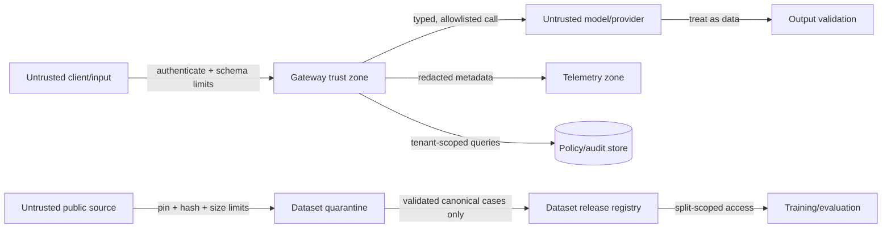

# AI security and threat model — SentinelForge

SentinelForge is the portfolio's primary AI-security project. It applies defense in depth and does not claim that a classifier or prompt can solve prompt injection.

## Assets and trust boundaries

Assets: model/provider credentials, tenant policies, confidential prompts/outputs, approval tokens, usage/cost data, audit records, model/classifier artifacts, public-source manifests, quarantined raw data, canonical cases, licence/provenance records, split membership and external holdout. Boundaries exist at client→API, API→policy/classifier, gateway→provider, model→output guard, tenant→storage, telemetry exporter, public source→quarantine and dataset release→training/evaluation.

## Principal threats and controls

| Threat | Prevent/detect controls | Required test |
|---|---|---|
| Direct/indirect prompt injection | Separate instructions/data, risk rules/classifier, typed tools, no policy mutation from content | Injected fixture cannot alter policy/route/tool allowlist |
| Sensitive data disclosure | Sensitivity policy, canary/PII output scan, egress constraints, content-off logs | Canary never appears in response, logs, or traces |
| Excessive agency/tool abuse | Deny-by-default tools, exact schemas, subject+tenant authorization, approval, step/cost/time limits | Unknown/elevated/cross-tenant tools denied |
| Unbounded consumption | Body/token/call/budget quotas, circuit breakers, bounded retry, rate limit | Recursive/oversized case terminates within budget |
| Cross-tenant access | Tenant context required in repositories/cache keys; object authorization | Tenant A cannot fetch Tenant B decision/policy |
| Improper output handling | JSON schema, size limit, escaping, URL/content rules | Model-supplied script/SQL is displayed as data, not executed |
| Supply-chain compromise | Locked hashes, SBOM, signed releases/artifact hash, dependency/container scanning | CI fails on tampered classifier/policy artifact |
| Telemetry leakage | Metadata-only default, redaction, restricted access, retention, cardinality control | Snapshot scan contains no fixture secret/prompt |
| Approval replay/race | Expiry, nonce, scoped hash, idempotency, transactional consume | Second consume fails; changed request invalidates approval |
| Policy tampering | Immutable versions, evaluation gate, signed activation audit, rollback | Candidate failing security suite cannot activate |
| Dataset supply-chain compromise | immutable revision/checksum, file/type/size limits, no source-code execution, quarantine, importer allowlist | moving/tampered/path-traversal/decompression-bomb source rejected |
| Dataset poisoning or benchmark contamination | provenance, source/family-aware splits, exact/near-duplicate detection, holdout access boundary, per-source metrics | injected duplicate across train/holdout blocks release; training cannot read holdout |
| Real PII/secrets in public data | pre-release privacy/secret scan, restricted review, quarantine, only nonfunctional canaries permitted | known secret/PII fixture cannot enter active release or Pages artifact |
| Licence/redistribution breach | component-level licence records, allowed-use policy, attribution bundle, disabled-by-default manifests, human review | missing/incompatible licence prevents release activation |
| Hostile content execution/rendering | import data only, isolated parser, escaped reviewer UI, no tools/models/providers in import identity | prompt/script/archive payload stays inert and cannot invoke network/tool/model |
| Label poisoning | source truth separated from policy truth, deterministic label templates, reviewer/adjudication states, immutable history | source attack label cannot directly set allow/deny/route/approval |

## Zero-trust and IAM model

- Authenticate every call and every service-to-service hop; never infer trust from network location.
- Authorize on subject, tenant, app, action, data sensitivity, requested tool, route, region, and current policy version.
- Separate `viewer`, `developer`, `policy_author`, `policy_approver`, `security_auditor`, and service identities.
- A policy author cannot approve their own production activation in the enterprise design; local demo shows two distinct fixture roles.
- Provider credentials are per-adapter, short-lived where supported, never returned to applications, and omitted in keyless mode.
- Dataset-import identity can write only quarantine/import metadata; it cannot read provider credentials, activate a dataset, publish policy, call gateway tools or access production prompt logs.
- Dataset reviewer and release approver are separate roles in the enterprise design. A source importer cannot approve its own release.

## Human approval gates and invariants

| Gate | Human role | Mandatory machine gates first | Security invariant |
|---|---|---|---|
| Elevated request/tool call | Authorized business/security approver | Identity, authorization, input classification, deterministic policy, tool schema and budget checks | Approval is one-time, expiring and bound to exact request/decision/tenant/subject/tool/arguments/policy; changed scope or replay fails closed |
| Production policy activation | `policy_approver` distinct from `policy_author` | Schema, simulation, authorization matrix, adversarial, quality, latency and budget gates | Author cannot self-approve; failing candidate cannot activate; activation and rollback are audited |
| Public-source enablement/dataset activation | Named source reviewer and dataset release approver distinct from importer | Pin/hash, licence/allowed use, quarantine, schema, privacy, label, leakage, coverage and evaluation gates | Human cannot waive a failed gate, grant uncertain licence rights or expose holdout to training |
| Sanitized production-shadow use | Organizational data/governance owner | Consent/purpose, minimization, privacy, retention/deletion and access controls | Raw customer content, credentials and production PII do not enter the public repository |

Approval never converts `DENY` into `ALLOW`, chooses an otherwise ineligible provider, expands a tool call, increases a budget, suppresses output/audit controls or mutates policy/data. Emergency kill switches and hard denies execute immediately without waiting for approval.

## Public-dataset trust policy

- Treat repository files, archives, notebooks, scripts, HTML, images and prompt text as hostile.
- Fetch an immutable revision only; verify checksums before parsing. Never follow a source's installation instructions as part of import.
- Reject absolute paths, traversal, symlinks outside quarantine, device files, unsupported compression and nested/unbounded archives.
- Parse with data libraries and allowlisted formats. Never deserialize pickle or execute macros/notebooks/source code.
- Keep raw data outside serving indexes and static Pages bundles. Reviewer display escapes markup and disables active content.
- Require source/component licence, attribution and allowed-use decision. Public visibility is not equivalent to permission to redistribute.
- Keep external holdout isolated through registry authorization, not naming convention or directory secrecy.
- A data-source update creates a new candidate release and repeats threat, privacy, licence, quality and evaluation gates.

## Responsible AI and governance mapping

- **NIST AI RMF:** Govern through ownership/policy/versioning; Map actors/data/failure impact; Measure with golden/adversarial evaluations; Manage via gates, rollback, incidents, and exceptions.
- **OWASP LLM/GenAI:** explicit cases for injection, disclosure, supply chain, data/model poisoning assumptions, output handling, excessive agency, vector weaknesses, misinformation, and consumption.
- **ISO 27001/SOC 2 evidence:** access review artifact, change/evaluation record, immutable logical audit, incident runbook, vulnerability scan, retention configuration. These are control-supporting artifacts, not certification.

## Security failure behavior

- Ambiguous high-risk request: deny or require approval; never “best effort” around policy.
- Classifier unavailable: deterministic critical rules remain; deny elevated/ambiguous actions.
- Provider returns malformed or sensitive output: discard, record reason code, optionally use a policy-eligible safe fallback.
- Audit store unavailable: read-only low-risk traffic may be configurable; elevated actions fail closed.
- Suspected compromise: trip kill switch by tenant/app/provider, revoke credentials, preserve minimized evidence, roll back policy/artifact.
- Dataset checksum/licence/privacy/leakage failure: quarantine the candidate, leave the active release unchanged and record a non-sensitive rejection reason.
- Suspected poisoned active dataset: deactivate the compatible classifier/policy bundle as required, restore last passing complete bundle, preserve release hashes and rerun private holdout before reactivation.

## Security verification schedule

- Every PR: unit/property/security fixtures, secret/dependency scan.
- Nightly/manual: full adversarial/metamorphic corpus, approved public-source update inspection, dataset/artifact integrity, privacy/leakage and container scans. No automatic activation.
- Before release: manual threat-model delta review, source/component licence review, dataset card and holdout-isolation review, authorization matrix review, load/budget abuse, rollback drill.
- Quarterly for a real deployment: key rotation, access review, incident tabletop, dependency/model provenance review, retention deletion test.
